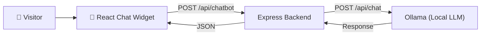

# 🤖 EventSphere Help Chatbot — Implementation Plan

## Overview

Build a **fine-tuned local LLM chatbot** for EventSphere using the **same pipeline as Igris-Training**:

```
generate_data.js → dataset.jsonl → Unsloth fine-tune (Colab) → GGUF → Ollama → Express API → React Widget
```

The chatbot helps visitors with event registration, tickets, payments, QR scanning, and platform navigation. Runs entirely on **Ollama** — fully offline, no cloud APIs.

---

## Architecture



**100% local. No cloud APIs. No API keys needed for chatbot.**

---

## Pipeline

| Step | Tool | What it does |
|------|------|-------------|
| 1 | `generate_data.js` | Generates ~15,000+ training examples from 39 intent templates |
| 2 | `dataset.jsonl` | JSONL format with system/user/assistant messages |
| 3 | `train_eventsphere.py` | Unsloth LoRA fine-tune on Qwen2.5-3B-Instruct (Google Colab free T4) |
| 4 | `.gguf` export | Q4_K_M quantized model (~2GB) for local inference |
| 5 | `Modelfile` | Ollama model definition with EventSphere system prompt |
| 6 | `ollama create` | Register the model in Ollama |
| 7 | Express route | `/api/chatbot` → Ollama local API |
| 8 | React widget | Floating chat bubble on all pages |

---

## Files Created

### ✅ Training Pipeline (Done)

| File | Status | Description |
|------|--------|-------------|
| [`chatbot/generate_data.js`](chatbot/generate_data.js) | ✅ Created | 39 intents, 300+ prompt patterns, 6 augmentations each |
| [`chatbot/train_eventsphere.py`](chatbot/train_eventsphere.py) | ✅ Created | Qwen2.5-3B-Instruct, LoRA r=16, 300 steps |
| [`chatbot/Modelfile`](chatbot/Modelfile) | ✅ Created | ChatML template, tuned inference params |
| [`chatbot/README.md`](chatbot/README.md) | ✅ Created | Full setup & deployment instructions |

### ⏳ Integration (After Training)

| File | Status | Description |
|------|--------|-------------|
| `backend/src/routes/chatbot.js` | ⏳ Pending | Express route → Ollama API |
| `backend/src/server.js` | ⏳ Pending | Mount chatbot route |
| `src/components/ChatBot.jsx` | ⏳ Pending | React floating chat widget |
| `src/App.jsx` | ⏳ Pending | Mount `<ChatBot />` globally |

---

## Execution Steps

### Now: Generate & Train
1. `cd chatbot && node generate_data.js` → creates `dataset.jsonl`
2. Upload `dataset.jsonl` to Google Colab
3. Paste `train_eventsphere.py` → Run (~30 min on free T4)
4. Download `.gguf` file → place in `chatbot/` folder
5. `ollama create eventsphere-chat -f Modelfile`

### After Training: Integration
6. Create `backend/src/routes/chatbot.js` (Ollama proxy)
7. Mount route in `server.js`
8. Create `src/components/ChatBot.jsx` (UI widget)
9. Mount in `App.jsx`

See [`chatbot/README.md`](chatbot/README.md) for detailed step-by-step instructions.
